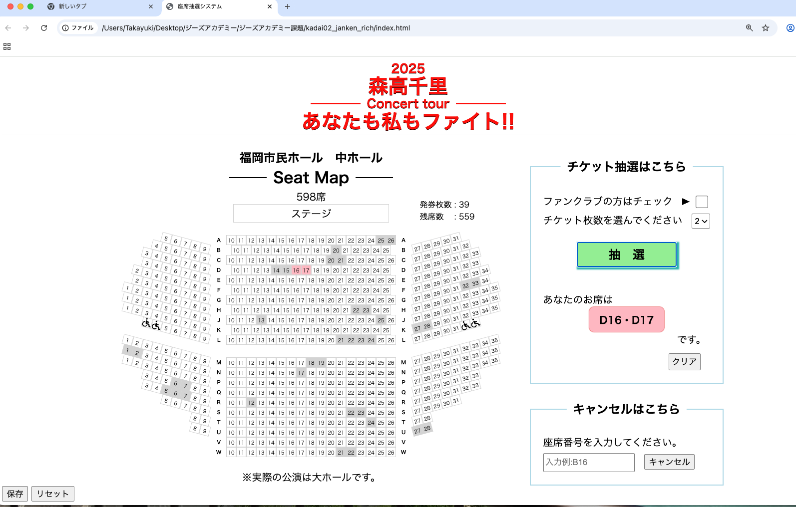

## 制作アプリのタイトル
    「2025森高千里コンサートツアー あなたも私もファイト!!」 
    福岡公演・座席抽選システム

## 制作アプリの説明（40文字程度）
    福岡市民ホール中ホール1Fのシートマップを再現し、抽選で座席を決めていくシステム。

## 工夫した点・こだわった点
-- 本物のホールの座席配置をできるだけ忠実に再現するよう試みた。
    A列は5番から31番、K列は1番から35番など列によって、席数が変わるほか、ところどころ26番の座席が抜けている、間に通路を挟むなどイレギュラーさも含めて、Jsで書き出したこと。抽選対象ではないが、車椅子席も再現。

以下のような、様々な仕組みを盛り込んだ。

-- 抽選結果をテキストだけではなく、マップ上に表示していくこと。
-- ファンクラブ会員の場合、センターブロック前方の良席が当たる確率が高まる仕組み。
-- チケット２枚ペアで発券するためのロジック、連番が確保できなくなったらその旨のアラート表示。
-- 座席のキャンセルが出たら、再び抽選可能座席として組み込まれる仕組み。
-- 最後の１席まで発券可能（一応、最後の１枚まで過不足なく発券できるか実地検証済み）。

以上のようなことを実現するためには、各座席に情報（列（例:A）、番号（例:10）、id（例：A10）、前後左右グループ、発券済みか否か等）をもたせる必要があり、結果的にオブジェクト化することになった。

-- ついでに、発券済みの座席をローカルストレージに保存、保存したデータの削除、保存データの再読み込みの機能もくっつけた。

## 次回トライしたこと（または機能）
    かなりいろいろ盛り込んだので、それほど思いつかないが、ログを残す機能や購入者の名前紐付け、座席クリックで何かのアクションなど。大ホールに挑戦するかどうか。。

	
## 備考（感想、シェアしたいこと等なんでも）
-- コンサートの座席は抽選で決まります。ファンクラブ会員で全公演参戦されるような超絶ガチな方でも、ヘタすると2階席に追いやられます。それはかわいそうだろうとも思いますが、一体どういう仕組みで抽選してるのだろうと思ったのが制作のきっかけです。
-- 実際の福岡公演は大ホールで行われますが、さすがに席数が多いので中ホールでトライしました。
-- 今回はCSSおよびレスポンシブには、あまり力を入れておりません。
-- シートマップが思いのほか完成度高く綺麗に表現できたのではないかと思います。同様のシートマップが描きたくなったら、このコードが使いまわせるかも。
-- いろいろと盛り込みすぎて、時間がかかりすぎ。もっと素早く終わらせられるようにしたい。
-- ChatGPTのサポートがないとなかなかここまでは辿り着けない。

### トップ画面キャプチャ画像

